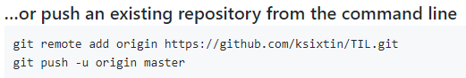

# Git 기초

## 0. 준비 사항

* [git bash](http://https://gitforwindows.org/) 설치.
  * git을 활용하기 위한 `CLI(Command Line Interface)`를 제공한다.
  * source tree, github desktop 등을 통해 `GUI` 환경에서도 활용 가능하다.

## 1. 로컬 저장소 활용하기

### 1. 저장소 초기화

``` bash
$ git init
Initialized empty Git repository in C:/LEO/til/.git/
(master) $
```


* 저장소(repository)를 초기화 하게 되면, '.git 폴더가 해당 디렉토리에 생성된다.
* bash 창에서는 (master)라고 표기된다.
  * 현재 브랜치가 master라는 것을 의미함.

## 2. add - staging area

> git으로 관리되는 파일들은 Working directory(작업 환경), Staging Area, commit 단계를 거쳐 이력에 저장된다.

~~~ bash
$ git add a.txt # 파일명
$ git add images/ # 폴더명
$ git add . # 현재 디렉토리의 모든 파일 및 폴더


~~~

* add 전 상태

  ~~~ bash
  $ git status
  On branch master
  
  No commits yet
  
  Untracked files:
    (use "git add <file>..." to include in what will be committed)
          git.md
          image/
          markdown.md
  
  nothing added to commit but untracked files present (use "git add" to track)
  ~~~
  
  
  
* add 후 상태

  ~~~ bath
  $ git add .
  $ git status
  $ git status
  On branch master
  
  No commits yet
  
  Untracked files:
    (use "git add <file>..." to include in what will be committed)
          git.md
          image/
          markdown.md
          penguin.jpg
  
  
  ~~~

  

## 3. commit

> 커밋은 코드의 이력을 남기는 과정이다.

~~~ bash
$ git commit -m '커밋 메시지'
[master (root-commit) 13be642] 마크다운 및 git기초 정리
 3 files changed, 102 insertions(+)
 create mode 100644 git.md
 create mode 100644 "image/\353\213\244\354\232\264\353\241\234\353\223\234.jpg"
 create mode 100644 markdown.md
~~~
* 커밋 메시지는 항상 해당 이력에 대한 정보를 담을 수 있도록 작성하는 것이 좋다.
* 일반적인 커밋 메시지를 작성하는 습관을 들이자.
* 특정 파일만 커밋하고 싶으면 git 파일명.확장자 -m '커밋 메시지'를 입력한다.

~~~ bash
$ git log
commit 13be642a93d7deab9e51b841b4a7ff240f688696 (HEAD -> master)
Author: Hae-gun <newchk610gmail.com>
Date:   Mon Dec 16 14:25:53 2019 +0900

    마크다운 및 git기초 정리

~~~

**항상 status 명령어를 통해 git의 상태를 확인하자! commit 이후에는 log 명령어를 통해 이력들을 확인하자!**


##### github에서 Create a new repository를 만들고 아래 2줄을 복사해서 git cmd에 넣고 엔터치면 로그인 창이 나오고 로그인을 하면 업로드 된다.




## 2. 원격 저장소 활용하기

> 원격 저장소(remote repository)를 제공하는 서비스는 다양하게 존재한다.
>
> github를 기준으로 설명한다.

### 0. 준비하기

​	Github에서 저장소(repository) 생성

### 1. 원격 저장소 설정

~~~ bash
$ git remote add origin {github url}
~~~

* {github url} 부분에는 원격 저장소 url을 작성한다.

* 원격 저장소(remote)로 {github url} 을 origin 이라는 이름으로 추가(add)하는 명령어이다.

* 원격 저장소 목록을 보기 위해서는 아래의 명령어를 활용한다.

  ~~~ bash
  $ git remote -v
  origin  https://github.com/ksixtin/TIL.git (fetch)
  origin  https://github.com/ksixtin/TIL.git (push)
  ~~~

## 2. push

~~~ bash
$ git push origin master
~~~

* 설정된 원격 저장소(origin)으로 push!

폴더의 내용을 수정 및 삭제, 생성 등을 하게 된다면, add, commit, 명령어를 통해서 이력을 저장하고 push 명령어를 통해 업로드 한다.


####  ※ 순서 : 파일저장> git add . > git commit -m '메세지' > git push origin master
